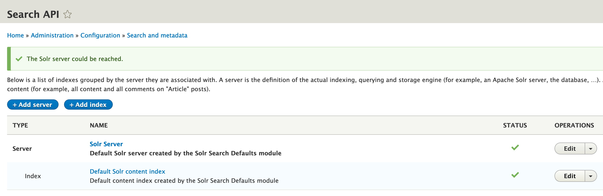
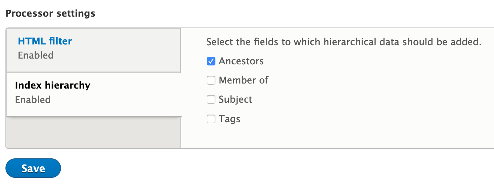

# Collection Search

How do I search only a certain collection or a collection and all sub-collections?

This functionality is provided in the Islandora Starter Site, with some nice UI sugar provided by the [Advanced Search module](https://www.drupal.org/project/advanced_search). If you want to configure collection search without that module, this recipe provides a way.

## Ingredients

* Drupal 10
* Solr
* A collection field, such as "Member of" (`field_member_of`)

## Instructions

### Creating shallow search

This is a simple view following the `member_of` relationship, though it could follow any parent-child relationship.

#### Creating an aggregated search

We need to create a field in Solr that the search view will use to search on. (This is not necessary if using the Advanced Search module)

To create the search field go to **Admin -> Configuration -> Search and Metadata -> Search API**



Then select your Index, here called _Index (Default Solr content index)_.

Then choose the **Fields** tab.

Click the **Add Fields** button.

In the overlay that appears, in the _General_ section choose to **Add an Aggregated field**.

On the next screen, under _Aggregation_ type select **Concatenation**.

Under _Contained Fields_ select all the fields you would like to search at once.

If you do not see a field displayed you might need to add it as a Solr field first (TODO: describe the steps)

Choose **Save** 

You are returned to the _Add fields_ screen, click **Done**.

You should see a _You have unsaved changes._ message.

At the top in the _General_ section you should now see a field with name **Aggregated Field**. 

Change the _type_ of this field to **Fulltext**.

Scroll to the bottom and click the **Save changes** button.

You should now see this message.


Click the **reindexing** link and travel to the following page.


Click the **Index now** button to re-index your data.

If you create or have a **Repository item** you should see an aggregated field in your Solr record. 

This will get you the first 20 records from Solr.
```
http://localhost:8983/solr/ISLANDORA/select?q=*:*
```

The `id` field contains a hash and then the path and language.

i.e. `44w7xh-default_solr_index-entity:node/4:en` == `node/4` == `http://localhost:8000/node/4`

The `tm_aggregated_field` will contain the concatenation of the fields you selected.

i.e. `["1933-05-13\n\nWinnipeg Tribune - May 13, 1933 - Page 3\n\n1"]`

---
#### Create the Shallow Search View Block

Now go to **Admin -> Structure -> Views**

Click the **Add View** button.

Give your view a name, ie. “Collection Search”

Under _View Settings_, change the **Show** dropdown to _Index Default Solr content index_.

Check the **Create a block** checkbox.

Your page should look something like this (assuming you used the same view names).


Scroll to the bottom and click the **Save and edit** button.

Now you are editing the view.

Under _Fields_ you will see _Index Default Solr content index: Aggregated field (indexed field)_, click that link


Click the **Remove** link at the bottom.

Now click the **Add** button to the right of _Fields_.

In the popup window, type **Title** in the _Search_ field and check the **Title** field. This is the field that will be displayed as the search result.

Click **Add and configure fields**.

On the next screen, under _Render settings_ check **Link to the Content**.


Finally click **Apply**

Now click the **Add** button to the right of _Filters_.

_Search_ for **Publish** and check **Publishing status**.

DO NOT CLICK _Add and configure fields_ yet!!!

_Search_ for your aggregated field name and select it. If you did not change the field name from the default, then search for **Agg** and check **Aggregated field**.

Now click **Add and configure fields**

First we configure the publishing status filter, select **True** and click **Apply and continue**


Next we are editing the aggregated field filter.

Check **Expose this filter to visitors,....**

Change the label from _Aggregated Field_ (or whatever) to what you want to appear beside this field. (ie. “Search”)


Click **Apply**.

Back in the View display, on the right hand side expand the _Advanced_ section.

Click **Add** to the right of _Contextual Filters_

_Search_ for **Member** and check the _Member of_ field

Click **Add and configure contextual filters**

Change the _When the filter value is NOT available_ drop down to **Content ID from URL**


Click **Apply**

Still in the _Advanced_ section change the _Use AJAX_ setting to **Yes**. To do this click the little _No_ link, check the _Use AJAX_ checkbox and click **Apply**.

Lastly under _Block settings_, change the _Block name_ to something recognizable. This will be what you look for when we place the block.

Now back at the View display, click **Save**

You can now [place this block](#adding-a-search-block-to-your-collection-if-you-are-using-islandora-defaults)

---
### Creating a Deep Search Block

This assumes you have done the above steps. It creates a new Solr field to index the `member_of` hierarchy.

#### Creating required search fields

Go to **Admin -> Configuration -> Search and Metadata -> Search API**


Then choose **Edit** operation on the _Index (Default Solr content index)_ line.

Then choose the **Fields** tab.

Click the **Add Fields** button.

Under _Content_ find the _Member of_ field and **Add** it.

Click **Done**

Under _Content_ you will have two _Member of_ fields. Look for the one with the _Machine name_ **field_member_of_1**.

Change the _Label_ of this field to **Ancestors** and change the _Machine name_ to **field_ancestors**.

Scroll to the bottom and click **Save changes**

Click the **Processors** tab at the top.

In the _Enabled_ area ensure that **Index hierarchy** is checked.

Scroll down to _Processor settings_, select **Index hierarchy**.

Select the **Ancestors** field.

Click **Save**



You should now see this message.


Click the _reindexing_ link and travel to the following page.


Click the **Index now** button to re-index your data.

If you check your solr records should now contain an _mt_ancestors__ field which will contain the parent chain following the Member Of relationship.

---
#### Create the Deep Search block

Go to **Admin -> Structure -> Views** and find the view you made previously and **Edit** it.

This view should contain just the one block so on the right hand side select the _Duplicate Block_ button.


This will duplicate all the settings to a new Block.

On the right in the _Advanced_ section.

**Add** a new _Contextual Filter_

Change _For_ from **All Displays** to **This block (override)**

_Search_ for **Ancestors** and check it.


Click **Apply (this display)**

Change the _When the filter value is NOT available_ drop down to **Content ID from URL**


Click **Apply (this display)**

Next in the _Advanced -> Contextual Filter_ section, click on **Content datasource: Member of**

Ensure the _For_ at the top is set to **This block (override)**

Then click the **Remove** link at the bottom.

Under _Block settings_, change the _Block name_ to something different that indicates it is a deep search.

Click **Save**

---
### Adding a search block to your collection (if you are using Islandora Defaults)

Go to **Admin -> Structure -> Context**


Find the _Collection_ context and click the **Edit** button on its line.

Scroll to the _Reactions_ section and you should see:


Click the **Place Block** button.

Locate your block name (it should have a _Type_ of _"List (Views)"_), click its **Place block** button.

Change the _Region_ to what you like, we are using **Sidebar second**.


Click **Add Block**

Scroll to the bottom of the page and click **Save and continue**.

View a collection and see the search block.

## Notes

This recipe was researched, tested and written as part of IslandoraCon 2019's Use-a-thon.

