# Date Range Slider Facet

A site wants to include a facet for date field(s) that presents itself as a range slider.

## Ingredients

* Controlled Access Terms (islandora/controlled_access_terms)
* An EDTF date field (like the one that comes with Controlled Access Terms)
* Drupal's jquery-ui-slider module (https://www.drupal.org/project/jquery_ui_slider, drupal/jquery_ui_slider)
* Drupal's facet module (https://www.drupal.org/project/facets, drupal/facets)
* "Facets range widget" - a submodule of the Facets module
* The library for jquery-ui-slider-pips (bower-asset/jquery-ui-slider-pips) along with jquery and jquery-ui

## Instructions
1. Install the required drupal modules. In your drupal root, use composer to install modules.
    - `composer require drupal/facets`
    - `composer require drupal/controlled_access_terms`
    - `composer require drupal/jquery_ui_slider`
2. Enable the modules (from the UI or from drush)
    - `drush pm-enable facets controlled_access_terms jquery_ui_slider facets_range_widget`
    (Note you may already have some or all of these modules included and enabled)
3. Set up your composer.json to install the bower asset properly.
    - Open the composer.json file in your drupal root in the editor of your choice.
    - In the "repositories" section add
    ```
        {
            "type": "composer",
            "url": "https://asset-packagist.org"
        }
    ```
    - In the "installer-paths" section, you should have one for the libraries directory, but you'll need to extend to it. It should look like:
    ```
        "web/libraries/{$name}": [
            "type:drupal-library",
            "vendor:npm-asset",
            "vendor:bower-asset"
        ],
    ```
    - In the "extra" section, add another section for installer types:
    ```
        "installer-types": ["npm-asset", "bower-asset"]
    ```
4. Add the composer-installers-extender plugin to allow composer to install to your web/libraries directory
    - `composer require oomphinc/composer-installers-extender`
5. Add the required bower library for jquery-ui-slider-pips
    - `composer require bower-asset/jquery-ui-slider-pips`
    - If the step 3 was completed successfully and this command ran successfully, you should see in your `web/libraries` directory the `jquery-ui-slider-pips` directory has been created and populated. It may also have added `jquery` and `jquery-ui` folders depending on your existing install.
6. Now you should be ready to move on to the UI components. Go to your search API solr index configuration on the Processors tab. If you're using a default Islandora set up, it's mostly located at `/admin/config/search/search-api/index/default_solr_index/processors`. Check the checkbox next to "EDTF Year".  This process will use the EDTF library to strip out the year from the date provided so that Solr can handle it as an integer, which allows us to make a facet slider.
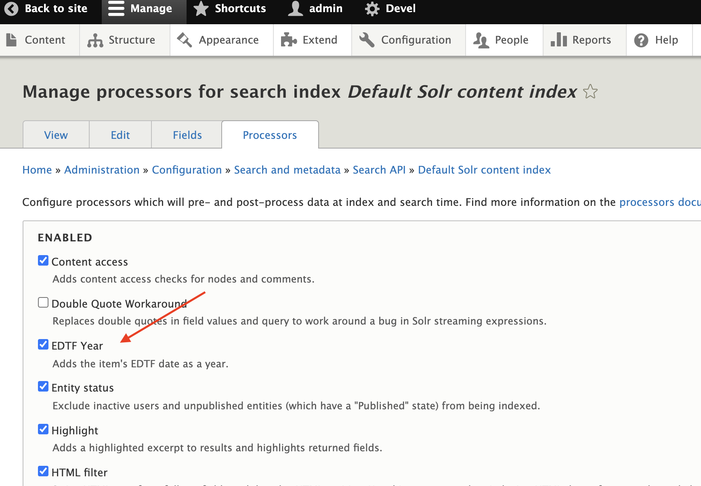
7. Scroll to the bottom of the processors page and configure the EDTF Year processor as desired. The configuration allows you to
- control which EDTF date fields you want to include this processing on.
- set the open interval begin year - sets the beginning year to be used when processing a date interval
- set the open interval end year - sets the last year to be used when processing a date interval (leave blank for the current year when last indexed)
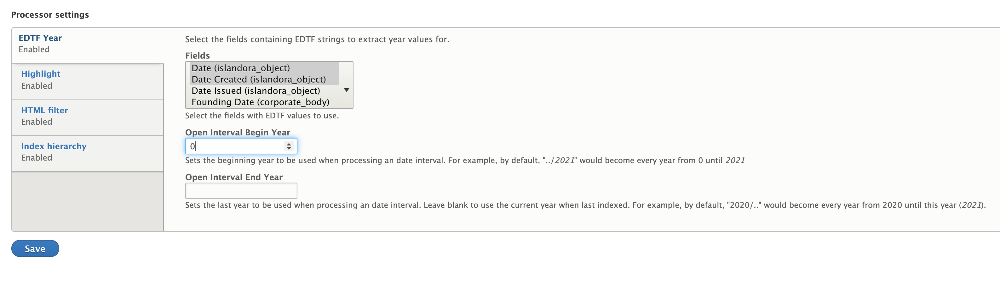
Save this config.
8. Go to the fields configuration for the same search API index (by default `/admin/config/search/search-api/index/default_solr_index/fields`) and add the EDTF Year field.
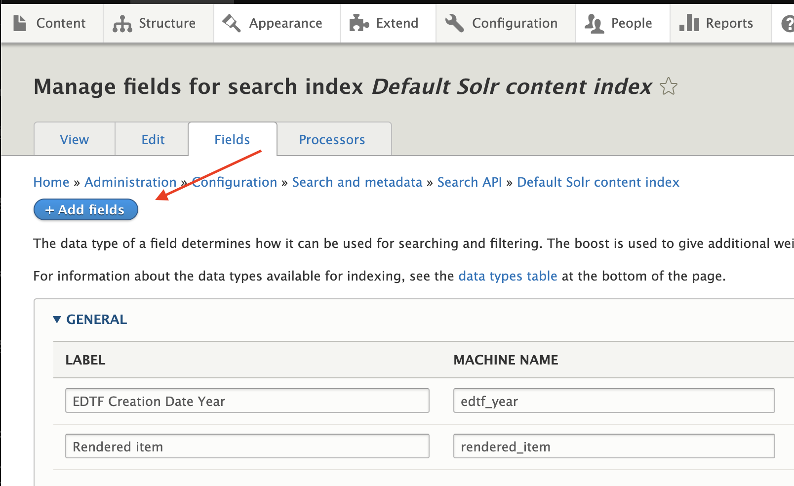
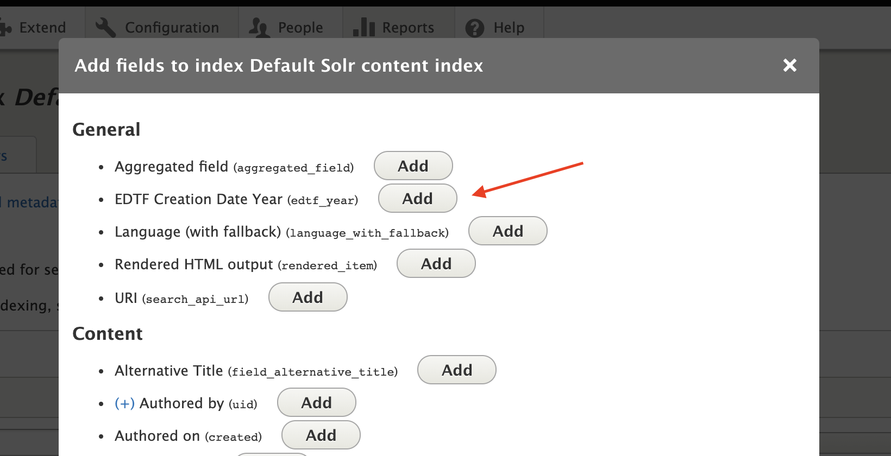
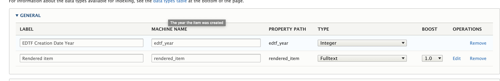
Set the display name and machine name for the field as desired.
9. Save this config.
10. Reindex your site (done via drush or on the main page for the index, by default `/admin/config/search/search-api/index/default_solr_index`)
At this point, you could verify that the years are in your solr index properly by either going directly to your Solr admin interface and performing a query. You should now see an indexed field with a machine name like the one you set in step 8 (in my example its indexed under `itm_edtf_year`)
11. Go to the facets configuration `/admin/config/search/facets` and click add facet
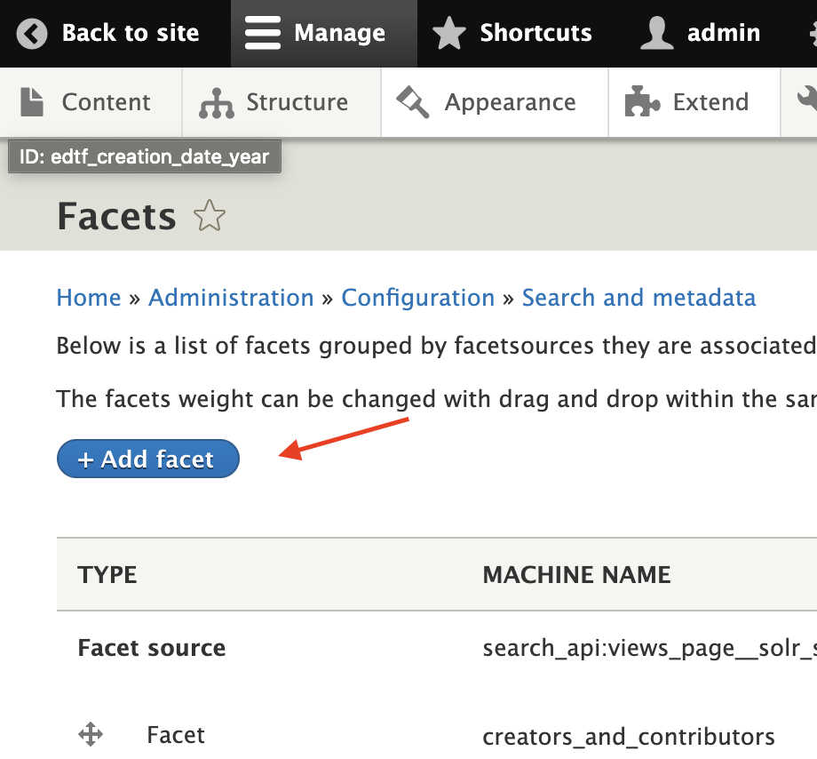
12. Choose the search view that you want the facet to show up on. In the screenshot below I chose the default Solr search view that Islandora ships with. After you choose a view, the Field dropdown will show up. Choose the field with you created. Then set the facet name (and machine name) as desired.
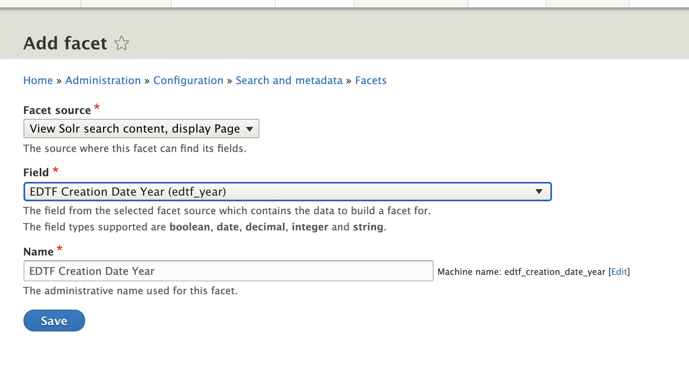
13. This will take you to the facet configuration page, which is quite lengthy. 
In the "Widget" section at the top, select "Range Slider". This will adjust a "Range Slider Settings" section just below it. Included in the screenshots are some simple default settings that you can change to meet your specific needs. Make sure the "slider" checkbox is checked in the main settings section. An easy one to miss (which is checked by default) is "Hide facet when facet source is not rendered" which will hide the facet unless you have the field also being displayed in the search result, so make sure you check/uncheck that according to what field you have displayed. I also disable all sorting since the slider should take over that. Then save the facet configuration. You can always come back later and adjust it if you need to.
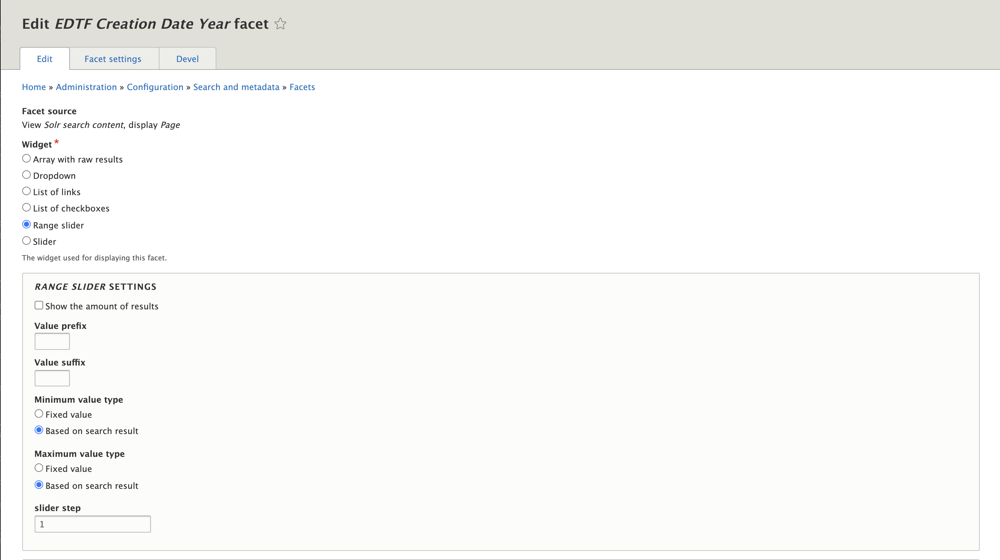
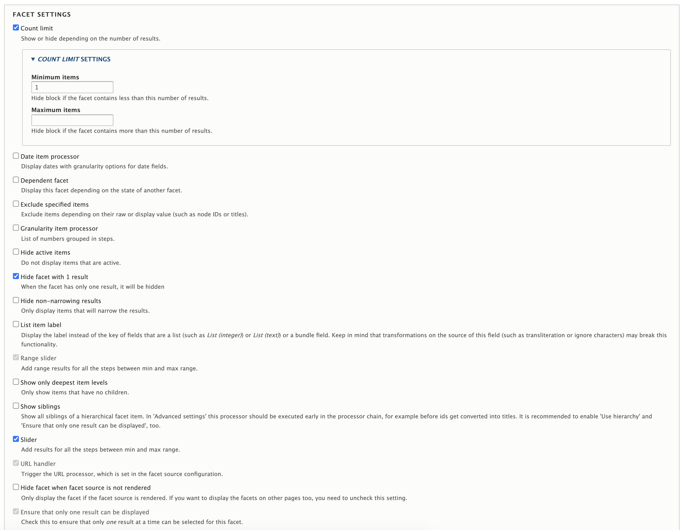
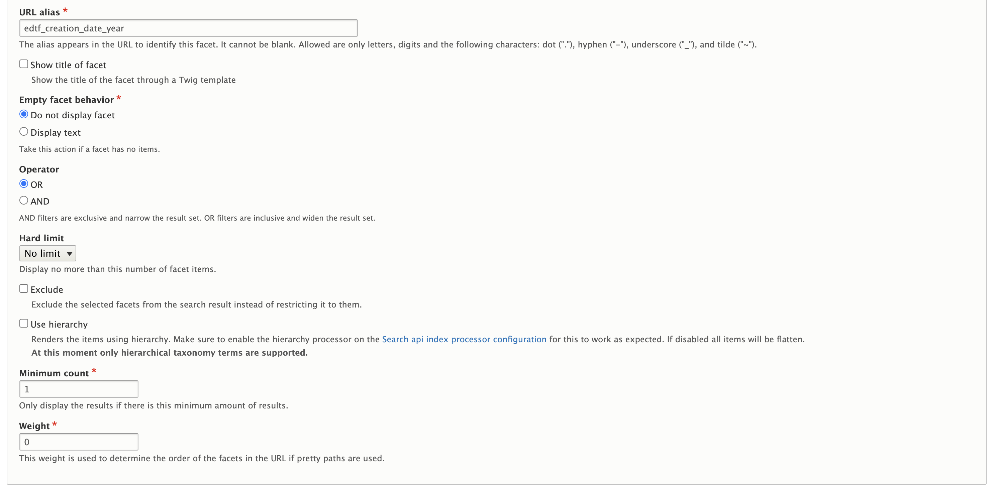
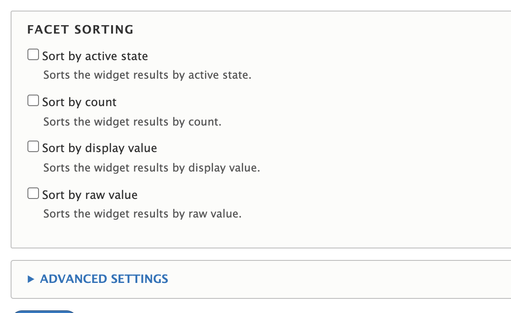
14. The next step is to make this facet visible on your search page. Go to "Structure" then "Block Layout" (`/admin/structure/block`) and scroll to whatever region you want to place the facet block in. Then Click "Place Block".
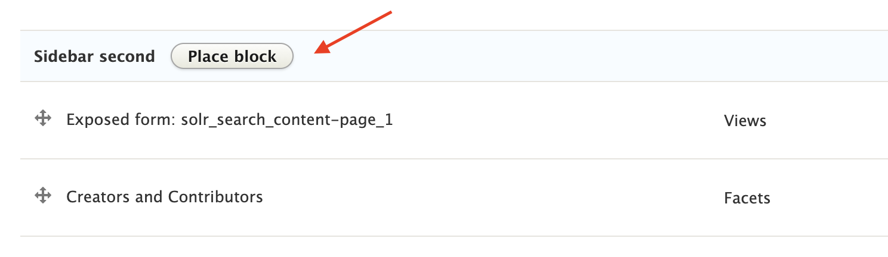
Search your block by its name and then click "Place Block" again
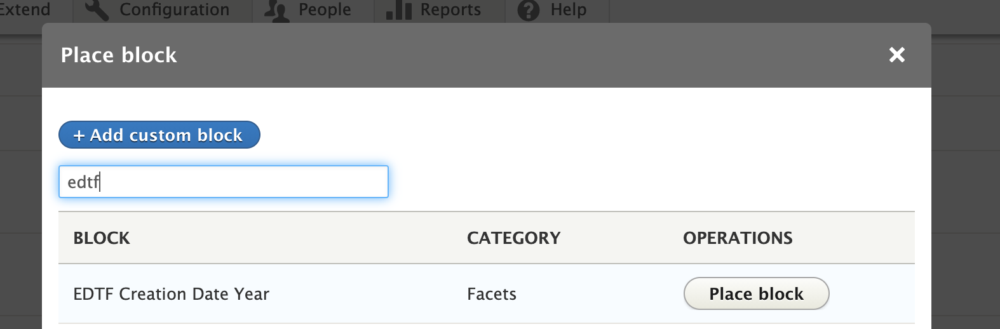
15. Control where the block is visible. In this example, it is set to only display on pages with a certain URL.
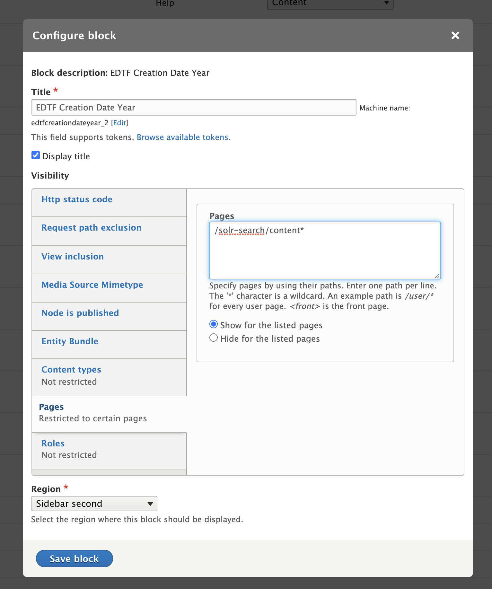
Save the block config.
16. View your search page and perform a query. You should see the facet block on the side:
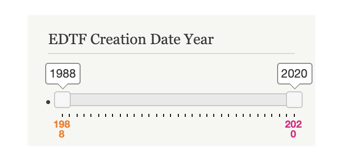
